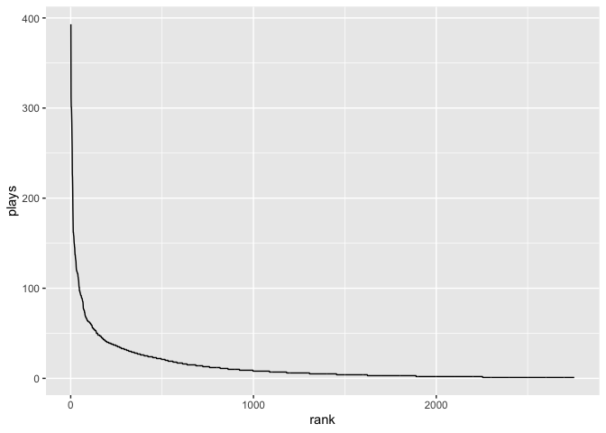

Sample RMarkdown Report
================
Sarah Risley

# Here’s a test! Class practice with Github. Woo!

*testing again*

## Including Code

You can include R code in the document as follows:

    ##      speed           dist       
    ##  Min.   : 4.0   Min.   :  2.00  
    ##  1st Qu.:12.0   1st Qu.: 26.00  
    ##  Median :15.0   Median : 36.00  
    ##  Mean   :15.4   Mean   : 42.98  
    ##  3rd Qu.:19.0   3rd Qu.: 56.00  
    ##  Max.   :25.0   Max.   :120.00

## Including Plots

# Plot

***plot***

**plot**

*plot*

[plot](#plot) \<- links it

image: 

> block quote

-   unordered list
-   item 2
    -   sub-item 1
    -   sub-item 2

You can also embed plots, for example:

<!-- -->

Note that the `echo = FALSE` parameter was added to the code chunk to
prevent printing of the R code that generated the plot.

## Example plot

    ##                          song rank plays
    ## 1 Dark Bird (St. Lucia Remix)    1   393
    ## 2                    Delicate    2   312
    ## 3        Almost (Sweet Music)    3   301
    ## 4                  The Archer    4   301
    ## 5                       Angel    5   293
    ## 6                       Clean    6   284

<!-- -->
